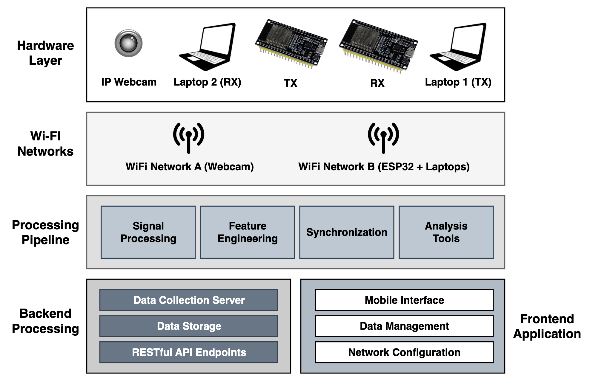
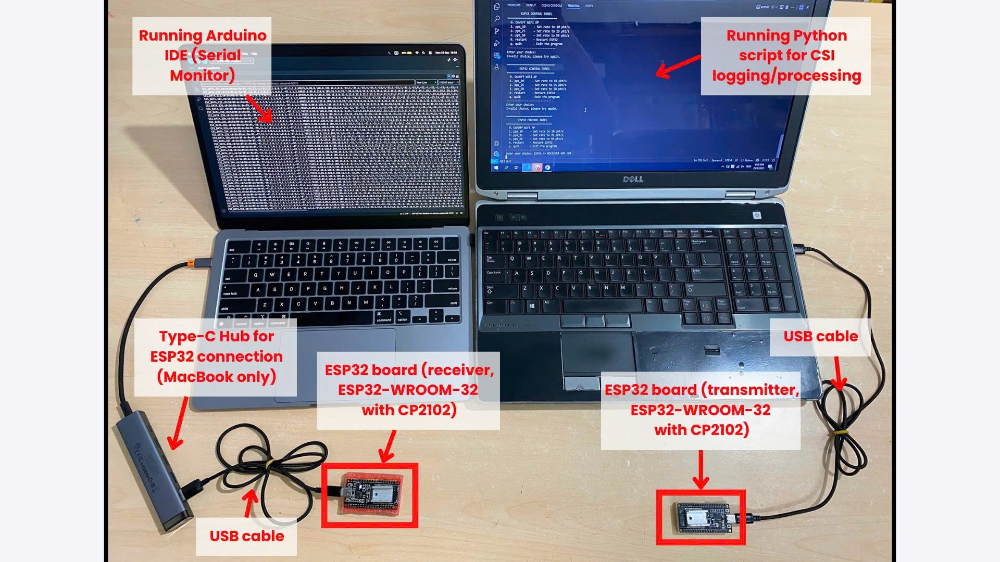
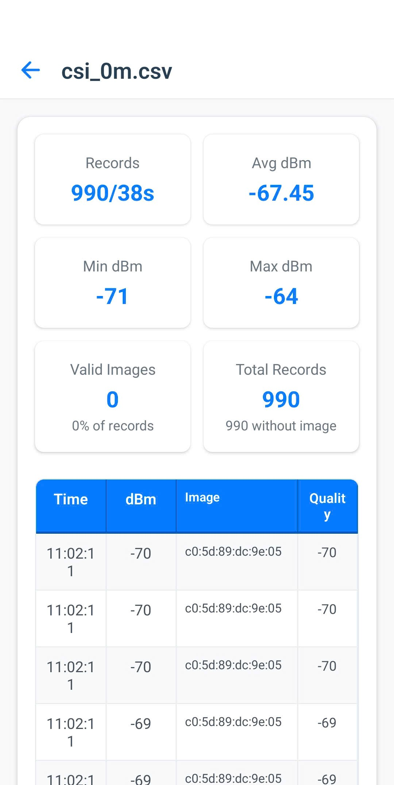
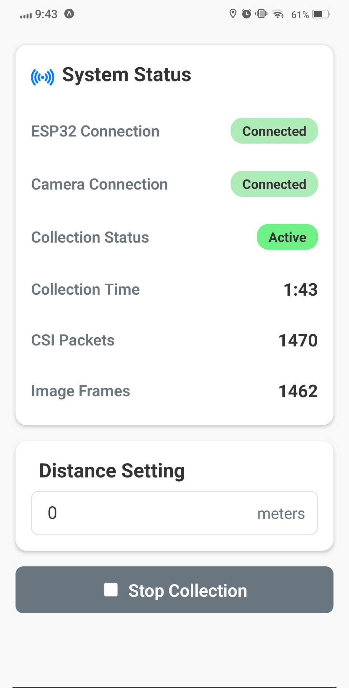
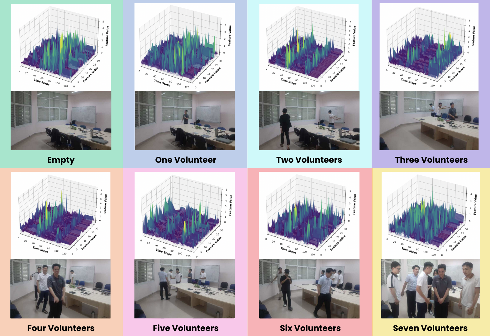
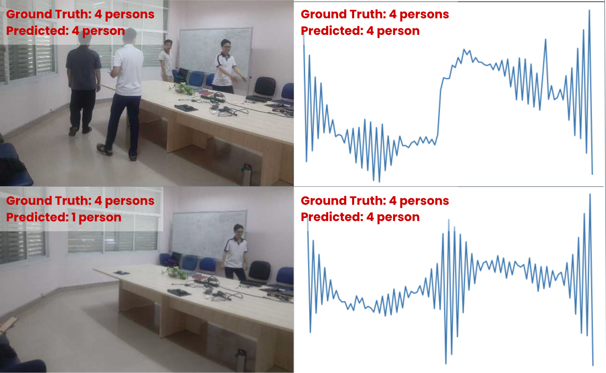
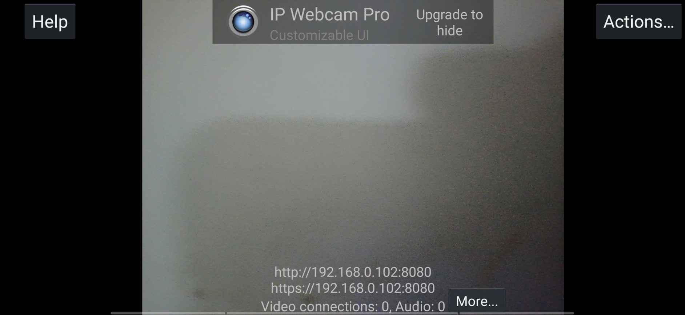

# CSI Application - WiFi Channel State Information for People Counting

## Overview & Motivation

This repository presents a comprehensive Channel State Information (CSI) system for WiFi-based people counting using ESP32 devices. The system addresses the growing need for non-intrusive, privacy-preserving indoor occupancy monitoring solutions by leveraging WiFi signals instead of traditional cameras or wearable sensors.

## Dataset Access & Research Applications

This repository includes a comprehensive WiFi CSI dataset for people counting research:

**Dataset Overview:**
- **8000 total samples** (6400 samples for training, 800 for validation and 800 samples kept for final testing)
- **8 occupancy levels** (0-7 people: from empty room to 7+ people)
- **Synchronized CSI + Visual data** (WiFi signals + camera frames for ground truth)
- **High-quality annotations** with precise people counting and timestamp synchronization

**Research Applications:**
- WiFi-based people counting and occupancy detection
- Non-intrusive indoor monitoring systems
- Smart building occupancy management
- Privacy-preserving crowd monitoring
- Real-time occupancy analytics

**Access Policy:** 
Access to the complete dataset and source code is restricted to academic and research use only. Interested researchers may request access for non-commercial research purposes.

**📧 How to Request Access:**
1. Click the [Google Drive Repository]([https://drive.google.com/drive/folders/1_zQK3YueUF6yZZ0mbjFeSwa58R1fDccK](https://drive.google.com/drive/u/3/folders/1s4TtS8UjizoMxQY0jQDFPiDxcqK4Hw1C)) link
  - `api/` - Flask backend source code
  - `CSIApp/` - React Native mobile application 
  - `data/` - Complete dataset (9,600 samples with CSI + visual data for people counting)
2. Click "Request Access" button in Google Drive
3. In the message field, include:
   - Your research affiliation (university/institution)
   - Intended use case for the people counting dataset
   - Brief description of your research project
   - Confirmation of academic/non-commercial use

**Example Request Message:**
```
Dear Repository Maintainer,

I am requesting access to the CSI people counting dataset for academic research purposes.

Institution: [Your University Name]
Research Purpose: WiFi-based people counting and occupancy detection research
Project: [Brief description of your research]
Usage: Academic research only, non-commercial

Thank you for your consideration.
Best regards,
[Your Name]
```

## System Architecture

### Hardware Setup

The experimental hardware consisted of two ESP32–CP2102 modules, configured as transmitter (TX) and receiver (RX), for wireless signal transmission and reception. Two laptops were used: Laptop 1 ran the transmitter script via VS Code, connected to the ESP32 TX module through a USB cable, while Laptop 2 ran the receiver script via Arduino IDE, connected to the ESP32 RX module. Laptop 2 also handled data acquisition and storage. A monitor and USB interfaces were used to monitor and control the data collection process. The ESP32 modules were positioned 11 meters apart at a height of 1.5 meters.

<div align="center">
  
</div>

*Overview of the experimental hardware setup, showing the ESP32 modules, laptops with their respective software (VS Code and Arduino IDE), USB connections, monitor, and data storage configuration.*

**Hardware Components:**
- **ESP32 TX Module**: Transmitter connected to Laptop 1 via USB cable
- **ESP32 RX Module**: Receiver connected to Laptop 2 via USB cable  
- **Laptop 1**: Running transmitter script via VS Code
- **Laptop 2**: Running receiver script via Arduino IDE, handling data acquisition
- **IP Webcam**: Android device for synchronized video recording
- **Network Infrastructure**: WiFi networks for device communication

### Software Setup

The software architecture consists of multiple layers to support data collection, processing, and visualization. The ESP32 modules communicate via two separate Wi-Fi networks: Network A for the Android IP Webcam, and Network B for the ESP32–laptop communication. The backend, implemented using Flask, handles data collection, storage, and exposes RESTful API endpoints. A data processing pipeline performs signal processing, feature extraction, synchronization, and analysis. The frontend mobile application, developed in React Native, provides the interface for data management and network configuration.

<div align="center">
  
</div>

*Software architecture and data flow, showing interactions between ESP32 modules, laptops, Wi-Fi networks, backend processing, data pipeline, and the frontend React Native application.*

**Software Components:**
1. **Hardware Layer**
   - ESP32 WiFi CSI devices for signal transmission and reception
   - IP Webcam integration for synchronized video recording
   - Network infrastructure with dual WiFi networks

2. **Backend Processing (Flask API)**
   - Data collection server receiving CSI data from ESP32 modules
   - Real-time processing for CSI amplitude/phase extraction
   - Data storage with structured CSI measurements and metadata
   - RESTful API endpoints for data access and visualization

3. **Frontend Application (React Native)**
   - Mobile interface for cross-platform data visualization
   - Real-time monitoring of live CSI signals and analysis
   - Data management for file handling and export
   - Network configuration for IP and device setup

4. **Data Processing Pipeline**
   - Signal processing for CSI amplitude extraction and noise filtering
   - Feature engineering with statistical and frequency domain features
   - Synchronization with timestamp-based alignment of CSI and visual data
   - Analysis tools for visualization and statistical analysis

**Data Flow:** ESP32 TX → Laptop 1 → Wi-Fi Network B → Laptop 2 → Backend → Mobile Application, ensuring synchronized and reproducible acquisition of multimodal data.

### Mobile Application Screenshots

<div align="center">
  
  
</div>

*Left: Real-time CSI data collection and system status monitoring | Right: CSI data visualization and analysis interface*

## Dataset Description

### Dataset Statistics & Distribution

| Split | Samples | Classes | CSI Files | Images 
|-------|---------|---------|-----------|--------
| Train | 8,000   | 8 (0-7) | 8         | 8,000   
| Test  | 1,600   | 8 (0-7) | 8         | 1,600   

### Class Distribution & Balance

| Class ID | Number of People | Description | Train Samples | Test Samples | Total |
|----------|-----------------|-------------|---------------|--------------|-------|
| 0 | 0 people | Empty room | 1,000 | 200 | 1,200 |
| 1 | 1 person | Single occupant | 1,000 | 200 | 1,200 |
| 2 | 2 people | Two people | 1,000 | 200 | 1,200 |
| 3 | 3 people | Three people | 1,000 | 200 | 1,200 |
| 4 | 4 people | Four people | 1,000 | 200 | 1,200 |
| 5 | 5 people | Five people | 1,000 | 200 | 1,200 |
| 6 | 6 people | Six people | 1,000 | 200 | 1,200 |
| 7 | 7 people | Seven people | 1,000 | 200 | 1,200 |



### Data Collection Protocol

**People Counting Methodology:**
- Manual counting and validation by trained researchers
- Ground truth verification through synchronized video recordings
- Precise people counting with timestamp-based synchronization (<50ms accuracy)
- Cross-validation of occupancy counts by multiple annotators
- Consistent counting protocol across all recording sessions

**Collection Environment:**
- Indoor laboratory setting (5m × 4m room)
- Controlled lighting and environmental conditions
- ESP32 positioned at fixed location (1.5m height) for optimal CSI coverage
- IP Webcam recording at 30 FPS with timestamp logging for ground truth
- Standardized people positioning and movement patterns for each occupancy level

**Ethical Considerations:**
- Data collected with informed consent from all participants
- No personally identifiable information stored
- Privacy-preserving methodology using WiFi signals instead of facial recognition
- Compliance with institutional research ethics guidelines
- Anonymous data sharing for research purposes only





### System Requirements
- **Hardware**: ESP32 development board, WiFi router, Android device (for IP Webcam)
- **Software**: Python 3.8+, Node.js 16+, Expo CLI, React Native environment

### Basic Usage
1. Configure network settings for all devices on same WiFi
2. Start Flask backend server on laptop/computer
3. Launch mobile app and configure API endpoints
4. Begin data collection with synchronized CSI and video recording

*For detailed installation and configuration instructions, see [Appendix A: Implementation Details](#appendix-a-implementation-details)*

## Appendix A: Implementation Details

### After Downloading from Google Drive

**1. Extract and Setup Project Structure:**
After downloading from Google Drive, your folder structure should look like this:
```
CSI-Application/
├── images/ 
├── utils/ 
├── visualize/ 
├── api/                    # Flask Backend
│   ├── route.py           # Main Flask application
│   └── ...               # Other backend files
├── CSIApp/                # React Native Mobile App
│   ├── package.json      # Node.js dependencies
│   ├── App.tsx           # Main React Native app
│   ├── index.ts          # Entry point
│   ├── components/       # UI components
│   ├── screens/          # App screens
│   ├── services/         # API services
│   └── ...              # Other frontend files
├── data/                  # Complete Dataset
│   ├── train/            # Training data (8,000 samples)
│   │   ├── labels.csv    # Training labels
│   │   ├── csi/          # CSI data files
│   │   └── images/       # Camera frames
│   └── test/             # Test data (1,600 samples)
│       ├── groundtruth.csv
│       ├── csi/
│       └── images/
└── README.md             # This documentation
├── requirements.txt.     # Dependecies 
```

**2. Prerequisites Installation:**

Install required software before proceeding:

```bash
# Install Node.js (v16 or higher)
# Download from: https://nodejs.org/

# Install Python (3.8 or higher)
# Download from: https://python.org/

# Install Git (if not already installed)
# Download from: https://git-scm.com/

# Verify installations
node --version    # Should show v16.x.x or higher
npm --version     # Should show 8.x.x or higher
python --version  # Should show Python 3.8.x or higher
```

**System Requirements Check:**

```bash
# Check system compatibility
python -c "import sys; print('✓ Python OK' if sys.version_info >= (3,8) else '✗ Python 3.8+ required')"
node -e "console.log(process.version >= 'v16' ? '✓ Node.js OK' : '✗ Node.js v16+ required')"

# Check available disk space (dataset is ~2GB)
df -h .  # Unix/macOS
# dir   # Windows

# Check RAM (recommended 4GB+)
free -h  # Linux
# Activity Monitor > Memory # macOS
# Task Manager > Performance # Windows
```

### Complete Setup Instructions

**3. Backend Setup (Flask API):**

```bash
# Navigate to project root
cd CSI-Application

# Navigate to API directory
cd api

# Create Python virtual environment (recommended)
python -m venv venv

# Activate virtual environment
# On macOS/Linux:
source venv/bin/activate
# On Windows:
# venv\Scripts\activate

# Install Python dependencies
pip install -r requirements.txt

# Run the Flask server
python route.py
```
The Flask server will start on `http://localhost:5001`

**4. Frontend Setup (React Native App):**

```bash
# Open new terminal and navigate to CSIApp directory
cd CSI-Application/CSIApp

# Install Node.js dependencies
npm install

# Install Expo CLI globally (if not installed)
npm install -g @expo/cli

# Install Expo development tools
npm install -g @expo/ngrok@^4.1.0

# Verify Expo installation
expo --version
```

**5. Mobile App Configuration:**

Create a `.env` file in the `CSIApp/` directory:
```bash
# Navigate to CSIApp directory
cd CSI-Application/CSIApp

# Create environment configuration file
touch .env

# Edit .env file with your network settings
echo "EXPO_PUBLIC_API_HOST=YOUR_COMPUTER_IP" >> .env
echo "EXPO_PUBLIC_API_PORT=5001" >> .env
echo "EXPO_PUBLIC_API_TIMEOUT=10000" >> .env
```

Find your computer's IP address:
```bash
# On macOS/Linux:
ifconfig | grep "inet " | grep -v 127.0.0.1

# On Windows:
ipconfig | findstr "IPv4"

# Example IP: 192.168.1.100
# Update .env file with your actual IP:
# EXPO_PUBLIC_API_HOST=192.168.1.100
```

**6. Start the Mobile Application:**

```bash
# In CSIApp directory, start Expo development server
npm start

# Alternative commands for specific platforms:
npm run android  # For Android device/emulator
npm run ios      # For iOS device/simulator  
npm run web      # For web browser
```

**7. Install Expo Go App (Mobile Device):**

- **Android**: Download "Expo Go" from Google Play Store
- **iOS**: Download "Expo Go" from App Store
- Scan QR code from terminal to run app on your device

### Network Configuration & Testing

**8. Verify Network Connectivity:**

Ensure all devices are on the same WiFi network:

```bash
# Test Flask server is running
curl http://localhost:5001/api/status

# Test from mobile device (replace with your IP)
curl http://192.168.1.100:5001/api/status

# Check if devices can communicate
ping 192.168.1.100  # From mobile device to computer
```

**9. Complete System Test:**

```bash
# Terminal 1: Start Flask backend
cd CSI-Application/api
python route.py

# Terminal 2: Start mobile app (in new terminal)
cd CSI-Application/CSIApp
npm start

# Mobile Device: Open Expo Go app and scan QR code
```

### ESP32 & IP Webcam Setup (Optional)

**10. ESP32 Configuration:**
- Flash ESP32 with CSI firmware (contact for ESP32 code)
- Connect ESP32 to same WiFi network
- Configure ESP32 to send data to computer IP:5001

**11. IP Webcam Setup:**
- Install "IP Webcam" app on Android device
- Connect Android device to same WiFi network
- Start IP Webcam server (note IP address and port)
- Update mobile app settings with webcam IP

### Troubleshooting Common Issues

**Connection Problems:**
```bash
# Check if Flask server is accessible
netstat -an | grep 5001

# Check firewall settings (macOS)
sudo pfctl -d  # Temporarily disable firewall for testing

# Check firewall settings (Windows)
# Windows Security > Firewall > Allow an app through firewall

# Verify network connectivity
ping google.com    # Test internet connection
ping 192.168.1.1   # Test router connection
```

**Mobile App Issues:**
```bash
# Clear Expo cache
expo r -c

# Reset Metro bundler
npx react-native start --reset-cache

# Reinstall dependencies
rm -rf node_modules package-lock.json
npm install
```

**Python/Flask Issues:**
```bash
# Check Python version
python --version

# Reinstall requirements
pip uninstall -r requirements.txt -y
pip install -r requirements.txt

# Check for port conflicts
lsof -i :5001  # Check what's using port 5001
```

### Data Collection Workflow

**12. Start Data Collection:**

1. Ensure all devices connected to same WiFi
2. Start Flask backend server
3. Launch mobile app via Expo Go
4. Configure network settings in app
5. Start ESP32 device (if available)
6. Begin data collection from mobile app
7. Monitor real-time CSI data and camera feed
---

*This documentation provides comprehensive information about the CSI Application dataset and implementation. For technical questions or dataset access, please refer to the contact information provided above.*
